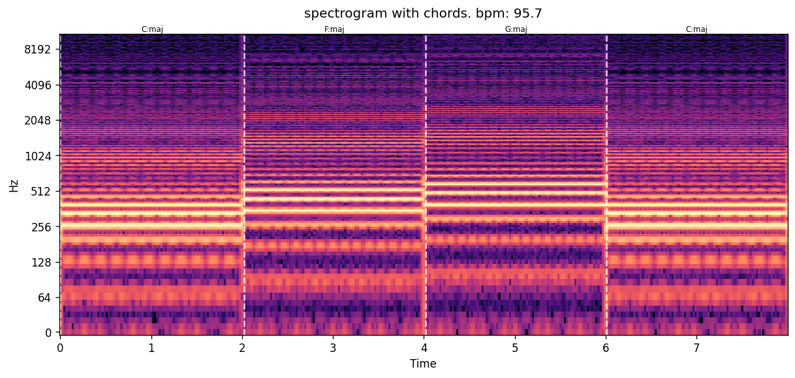

# chord-bpm-detector
BPM and chord detector for audio analysis

It is a personal learning project built to learn Python, DSP and librosa. Every part is understood and intentional. 

Audio analysis tool that detects tempo (BPM) and chord progression (only major and minor triads) from an audio, with visualization and JSON output. Built from scratch in Python on top of librosa.



## Usage

```bash
python3 -m venv .venv && source .venv/bin/activate
pip install -r requirements.txt
python3 cli.py song.wav --plot output.png --json
```

## How it works

Analysis starts by loading the audio as a mono signal at 22050 Hz sample rate. Then, the pipeline splits into two independent branches that share the same spectral information.

For tempo, an onset strength envelope is computed (a signal that measures how much new spectral energy appears at each instant compared to the previous one). `librosa.beat.beat_track` applies autocorrelation over that envelope to find the periodicity, equivalent to the BPM, and lays out a beat grid aligned to the peaks. 

For chords, a chromagram is computed via CQT. This is a matrix that folds all frequency content into the 12 notes (C, C#, D, D#,...), adding each note's energy across all octaves. Via cosine similarity each instant of the chromagram is compared against a 24 chord template (one major and one minor chord per note) and assigned the best match. Then, consecutive frames sharing the same chord are grouped into segments with their start and end time. 

## Known limitations

- Tempo estimates are not completely precise due to internal smoothing of the onset envelope and timing jitter. 

- `beat_track` can miss the first beat of a file.

- There is high risk of octave error (detecting half or double of the real tempo).

- The tempo detector is not good if there's sustained sound with no percussion. It will output a mistaken result. 

- Chord classification only distinguishes simple major and minor triads, other types of chords should be added to the template for it to detect them. Meanwhile, they will output them as the closest major or minor triad.

- Major chords can be confused with their relative minor and viceversa due to the shared notes.

## Next steps

- REST API with FastAPI to expose `analyze_audio` over HTTP. 

- n8n automation workflow: drop an audio file in a folder, get it analyzed and archived automatically.

## Stack

Python | NumPy | SciPy | librosa | Matplotlib | FastAPI


## Author 

Iago Alvarez Solache

